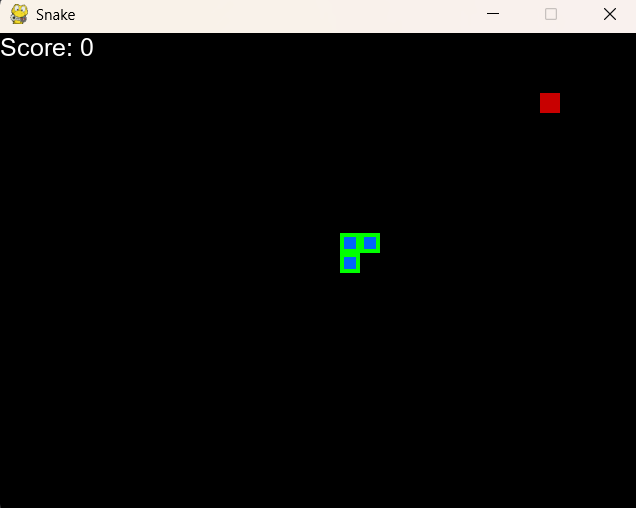
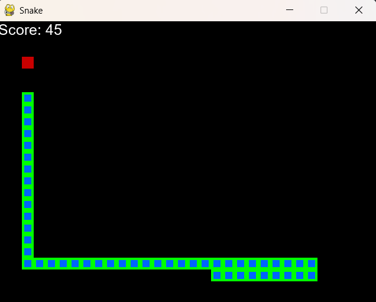
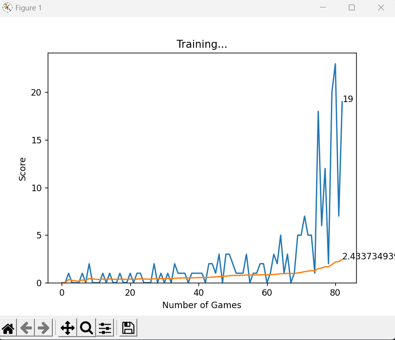
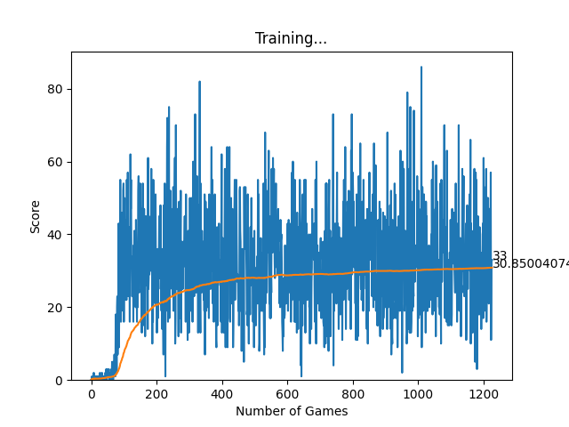

# SnakeGame_DQN

A Python project that uses **Deep Q-Learning (DQN)** to train an AI to play the classic Snake game. The AI learns via experience replay and reward shaping to maximize its score and survival.

---

## 🚀 Features

- Deep Q-Learning (DQN) based AI for Snake.
- Experience replay and batch training for stable learning.
- Reward shaping to encourage efficient movement and survival.
- Optional Pygame visualization of the snake’s gameplay.
- Automatically saves the best-performing model (`model.pth`).

---
## 📷 Screenshots
### 1. Snake Game Start & AI Playing the Game

<p float="left">
  
  
  
  
</p>

### 2. Training Progress Plot

<p float="left">
  
  
  
  
</p>

---

## 🛠️ Installation

1. Clone the repository:

```bash
git clone https://github.com/Lovish-Mehra-06/SnakeGame_DQN.git
cd SnakeGame_DQN
````

2. (Optional) Create a virtual environment:

```bash
python -m venv venv
# Windows
venv\Scripts\activate
# macOS/Linux
source venv/bin/activate
```

3. Install dependencies:

```bash
numpy
matplotlib
pygame
pytorch
```

---

## ▶️ Usage

1. Run the training script:

```bash
python agent.py
```

2. To **train faster**, disable Pygame rendering in `agent.py`:

```python
game = SnakeGameAI()
```

3. The **best model** is automatically saved as `model.pth` when a new high score is achieved.

4. The agent will **load the saved model** if `model.pth` exists, allowing training to continue from previous progress.

---

## 📈 Reward System

| Event                           | Reward |
| ------------------------------- | ------ |
| Eating food                     | +10    |
| Dying                           | –10    |
| Small movement penalty          | –0.01  |
| Else                            |     0  |

---

## ⚙️ Code Overview

* `agent.py` — AI agent logic: state representation, action selection, memory, training loop.
* `model.py` — Neural network (Linear Q-Net) and trainer class.
* `game.py` — Snake game logic using Pygame.
* `helper.py` — Utility functions, including plotter for training progress.

---

## 📌 Tips

* Disable rendering to speed up training.
* Adjust reward values to improve learning behavior.
* Train longer for higher maximum scores.

---

## 🎓 Credits / Inspiration

This project is based on the **FreeCodeCamp Python + PyTorch + Pygame Reinforcement Learning – Train an AI to Play Snake**.

* [FreeCodeCamp Video Tutorial](https://www.youtube.com/watch?v=L8ypSXwyBds)

---

**Lovish Mehra** – [GitHub](https://github.com/Lovish-Mehra-06)

---

