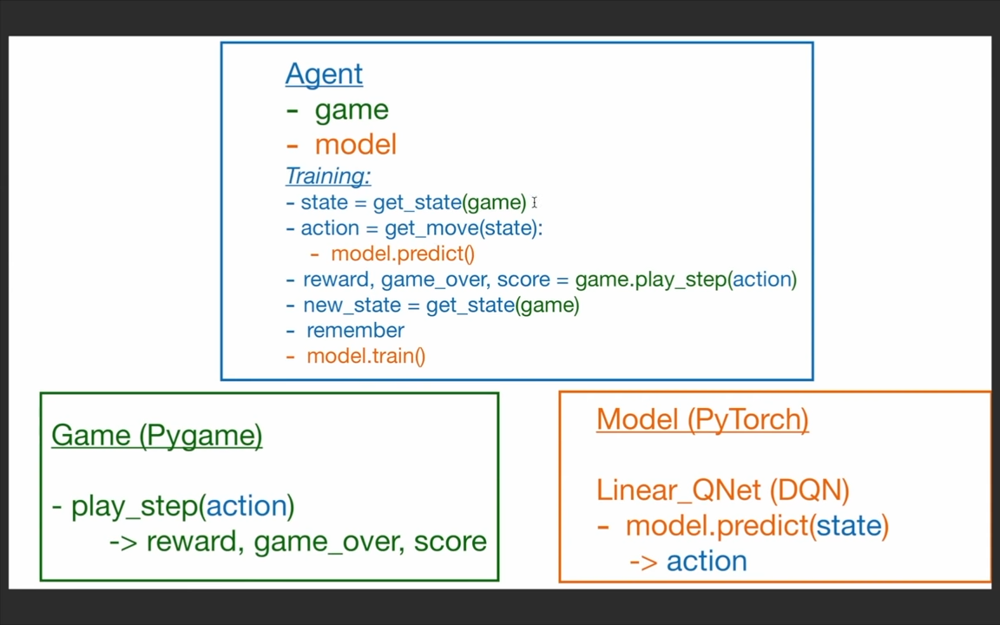
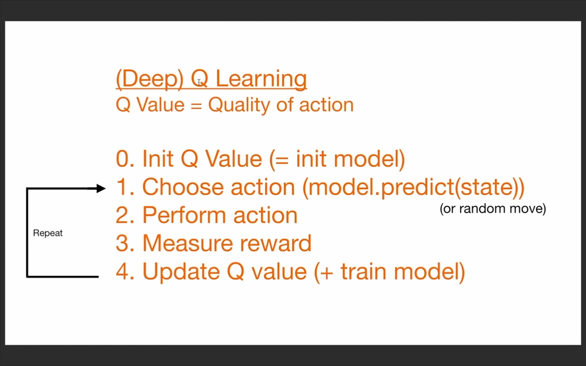
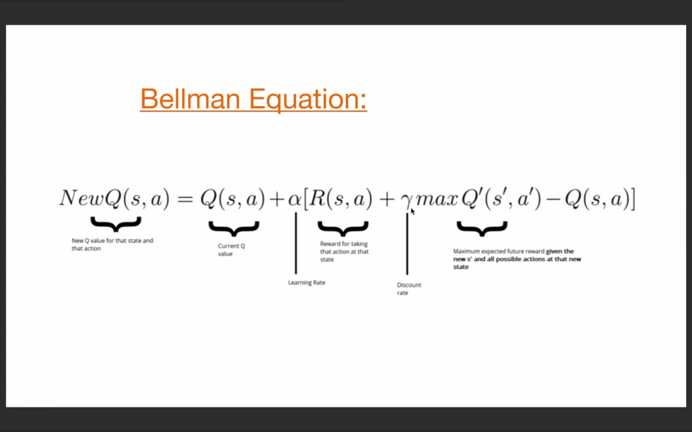
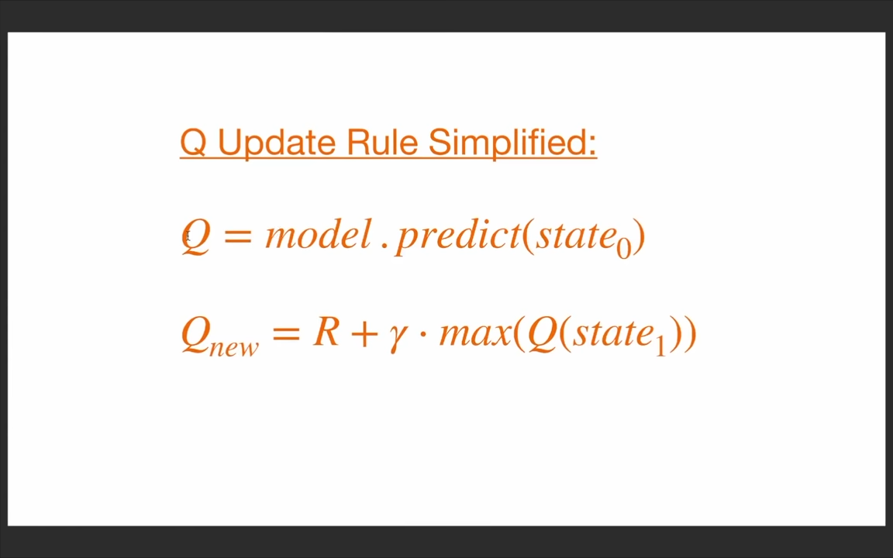
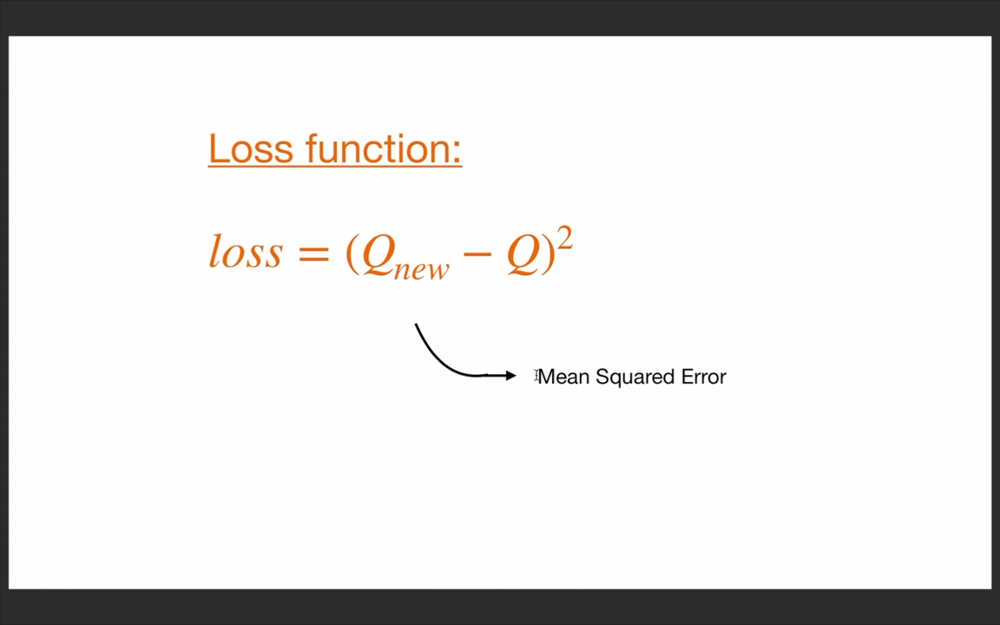

<!-- https://youtu.be/L8ypSXwyBds?si=_u8-gS9o1BEPvTvv -->

# \***\*Python + PyTorch + Pygame Reinforcement Learning – Train an AI to Play Snake\*\***

# Reinforcement Learning – Notes

## 1. What is Reinforcement Learning (RL)?

-   Reinforcement Learning is a branch of **machine learning** focused on how an agent should take actions in an environment to **maximize cumulative reward**.
-   Simply put, RL teaches a software agent **how to behave** by giving feedback on its performance.
-   As Patrick Loeber explains:
    > _"RL is teaching a software agent how to behave in an environment by telling it how good it's doing."_

---

## 2. Deep Q-Learning

-   Deep Q-Learning is an extension of traditional Reinforcement Learning.
-   It uses a **deep neural network** to predict the best actions for the agent.
-   Helps the agent learn optimal policies in more complex or high-dimensional environments.

<!--
# Reinforcement Learning – Workflow Notes

# Agent
- game
- model

### Training Loop
1. `state = get_state(game)`
2. `action = get_move(state)`
   - uses `model.predict()`
3. `reward, game_over, score = game.play_step(action)`
4. `new_state = get_state(game)`
5. `remember` (store experience)
6. `model.train()`

# Game (Pygame)
`play_step(action)`
`-> reward, game_over, score`

# Model (PyTorch)
`Linear_QNet (DQN)`
`model.predict(state)`
`-> action`
 -->
 

<!--
[alt text](image.png)
-->

---

# **_Reward System_**

## Rewards

-   **Eat food:** `+10`
-   **Game over:** `-10`
-   **Else:** `0`

---

# **_Action Encoding_**

## One-Hot Vectors

-   **`[1, 0, 0]` → `Straight`**
-   **`[0, 1, 0]` → `Right Turn`**
-   **`[0, 0, 1]` → `Left Turn`**

# **_State Representation (11 Values)_**

The state is encoded using the following 11 features:

### _Danger Detection_

**[ `Danger straight`, `Danger right`, `Danger left`**

### _Current Direction_

**`Direction left`, `Direction right`, `Direction up`, `Direction down`,**

### _Food Location_

**`Food left`, `Food right`, `Food up`, `Food down` ]**



---



---


R- reward,
gamma

---



---

---

<!-- EXTRA NOTES -->
<hr style="border: 2px solid #ccc;" />

# **Extra Notes:**

# ⭐ **Training Loop — Explained Step-by-Step**

## **1. `state = get_state(game)`**

You take the **current state** of the game.

-   In a game like Snake, the _state_ might include:

    -   Danger straight / left / right
    -   Current direction
    -   Food location

-   The state is usually turned into a **vector of numbers** (e.g., `[1, 0, 0, 1, 0, 1, ...]`).

👉 This is the information the agent uses to make decisions.

---

## **2. `action = get_move(state)`**

The agent decides **what action to take**.

Inside `get_move()`:

-   Sometimes the agent **explores** (random action).
-   Sometimes it **exploits** (uses the neural network).

### `model.predict(state)`

If exploiting:

-   The **DQN (Deep Q-Network)** takes the state as input.
-   It outputs **Q-values** for each action.
-   The agent picks the action with the **highest predicted reward**.

👉 Example actions for Snake: `[straight, right, left]`.

---

## **3. `reward, game_over, score = game.play_step(action)`**

You **apply the action** in the game.

The game responds and gives 3 things:

-   **reward** → feedback

    -   +10 for eating food
    -   -10 for dying
    -   0 or small reward for moving safely

-   **game_over** → True if snake dies
-   **score** → number of food pieces eaten

👉 This is where the agent sees the _consequence_ of its action.

---

## **4. `new_state = get_state(game)`**

You get the **updated state** after the action.

-   If the snake moved, state changes.
-   If it died, state is terminal.

👉 This “new state” is what the agent will learn from.

---

## **5. `remember` (store experience)**

You save a **memory** (called an experience or transition):

```
(state, action, reward, new_state, game_over)
```

This goes into the **Replay Memory**.

Why store it?

Because:

-   The agent learns from **past experiences**.
-   It improves stability in training.
-   It allows training on shuffled experiences (breaking correlations).

---

## **6. `model.train()`**

The neural network (DQN) gets updated.

Training uses:

-   Batch of memories from replay buffer
-   Loss function (MSE)
-   Q-learning formula:

```
Q(state, action) = reward + γ * max(Q(new_state))
```

👉 This step helps the model improve and make better predictions.

---

# 🎯 In simple words:

The agent repeats this loop:

-   1️⃣ Look at the world
-   2️⃣ Decide an action
-   3️⃣ Perform it
-   4️⃣ See what happened
-   5️⃣ Remember it
-   6️⃣ Learn from it

---

---

---

# **_Bellman Equation (Notes)_**

## 1. What is the Bellman Equation?

The Bellman Equation is a fundamental formula in Reinforcement Learning that describes the relationship between:

-   the **value** of a state, and
-   the **value** of the next state\*\* after taking an action.

It basically says:

> The value of the current state = immediate reward + value of the next state.

---

## 2. Bellman Equation (Q-Learning Form)

For Q-Learning, the Bellman equation is:

**Q(s, a) = r + γ \* max(Q(s', a'))**

Where:

-   **Q(s, a)** → value of taking action _a_ in state _s_
-   **r** → reward received
-   **s'** → next state
-   **max(Q(s', a'))** → best possible future value
-   **γ (gamma)** → discount factor (0 to 1)

---

## 3. What It Means (Intuition)

The agent updates its knowledge by combining two things:

1. **What just happened** (reward `r`)
2. **What it thinks will happen next** (best future value)

So it learns:

-   “If I do this action in this state, how good is it _in the long run_?”

---

## 4. Why Bellman Equation Matters in DQN

In Deep Q-Learning, the neural network tries to **approximate the Bellman equation**.

During training:

-   You calculate a **target Q-value** using the Bellman equation.
-   Then the model learns to match its prediction to that target.

This is how the agent improves over time.

---

## 5. Bellman Update in Code (Concept)

```python
target = reward + gamma * max(model.predict(next_state))
```

---

---

<hr style="border: 2px solid #ccc;" />
<hr style="border: 2px solid #ccc;" />

---

# **_Code Basic_**
